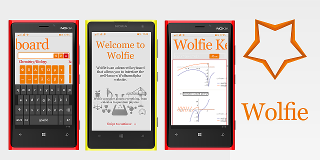

# Wolfie Keyboard

This is a Windows Phone 8.0 app meant to bring Wolfram Alpha (www.wolframalpha.com) functionalities on Windows Phone.
The app went live early 2014 and retired 2 years later from the Store following direct "kind, unmotivated complains" from WolframAlpha LLC itself, right after their official app went live.

It totalized roughly 100k downloads, overall.

The app has been featured in a variety of articles on blogs and websites:

* http://www.plaffo.com/2014/05/wolfie-keyboard-un-client-gratuito-del-noto-motore-computazionale-di-conoscenze/
* http://www.windowsteca.net/2015/01/wolfie-keyboard-lapp-ideale-per-risolvere-problemi-di-matematica-geometria-analisi-fisica-chimica-biologia/
* http://www.tuttowindows.net/news/wolfie-keyboard-windows-phone-29493/
* http://www.xatakawindows.com/aplicaciones-windows-phone/wolfie-keyboard-permite-usar-wolfram-alpha-de-forma-sencilla-en-windows-phone-la-aplicacion-de-la-semana
* http://nokialumia.es/2014/05/20/wolfie-keyboard-wolfram-alpha-gratis-para-windows-phone/
* http://fielinks.com/enlace/wolfie-keyboard-permite-usar-wolfram-alpha-de-forma-sencilla-en-windows-phone-la-aplicacion
* http://www.windowsphoneitaly.com/software/9592-wolfie-keyboard-la-nuova-versione-di-wolfie-il-client-non-ufficiale-per-windows-phone-di-wolframalpha.html

The app is fully localized in:

* Italian
* English
* Portoguese
* Spanish
* Simplified Chineese

Features of Wolfie:

* Keyboards optimized for Math
* Keyboards optimized for Statistics
* Keyboards optimized for Biology and Chemistry
* Manage your favorites
* Search History
* And everything else WolframAlpha can handle

Below here, a series of screenshots that show the content of the app:

